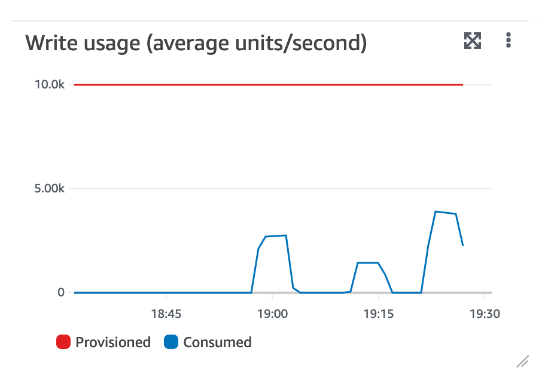
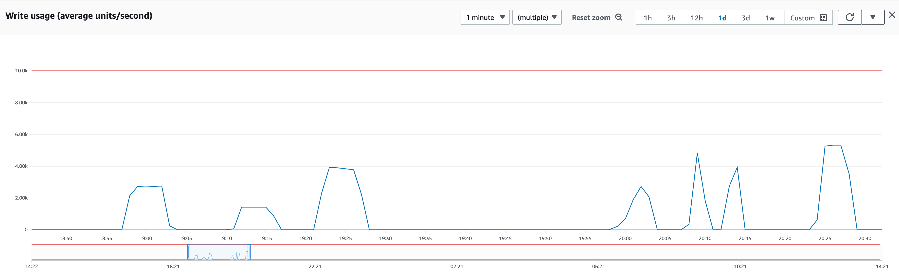

# Log

## ref.

https://e2eml.school/multiprocessing.html
python multi threading blog: https://towardsdatascience.com/multithreading-multiprocessing-python-180d0975ab29
batch update: https://stackoverflow.com/questions/44804994/dynamodb-batch-write-update
boto3: https://boto3.amazonaws.com/v1/documentation/api/latest/guide/dynamodb.html#batch-writing
python blocking queue: https://www.educative.io/courses/python-concurrency-for-senior-engineering-interviews/gkVzyO8V6Qj

## Insert records

### Read/Write = 100

```
    'ProvisionedThroughput': {
        'ReadCapacityUnits': 100,
        'WriteCapacityUnits': 100
    }
```
    
    2022-09-06T14:55:47.461Z: Deleting test_table
    2022-09-06T14:56:07.758Z: Creating test_table
    2022-09-06T15:24:46.812Z: Created test_table

28 minutes

count records in table

```
    aws dynamodb scan \
    --table-name test_table \
    --select COUNT
```


```
    'ProvisionedThroughput': {
        'ReadCapacityUnits': 200,
        'WriteCapacityUnits': 200
    }
```

12 minutes
    
    2022-09-08T17:46:17.446Z: Deleting test_table
    2022-09-08T17:46:37.731Z: Creating test_table
    2022-09-08T17:58:38.376Z: Created test_table

```
    'ProvisionedThroughput': {
        'ReadCapacityUnits': 500,
        'WriteCapacityUnits': 500
    }
```

3:40 minutes

    2022-09-08T18:52:20.484Z: Deleting test_table
    2022-09-08T18:52:40.758Z: Creating test_table
    2022-09-08T18:56:19.856Z: Created test_table


```
    'ProvisionedThroughput': {
        'ReadCapacityUnits': 1000,
        'WriteCapacityUnits': 1000
    }
```

2:46 minutes
800-900 kB/s

    2022-09-08T19:01:52.862Z: Deleting test_table
    2022-09-08T19:02:13.132Z: Creating test_table
    2022-09-08T19:04:59.333Z: Created test_table

    using 10_000 for capacity doesn't improve throughput


2 processes, 200k records, 1.7MB/s
5 minutes

2022-09-09T18:58:12.322Z: record: 0
2022-09-09T19:03:03.478Z: Created test_table
2022-09-09T18:58:14.490Z: record: 0
2022-09-09T19:03:08.005Z: Created test_table

3 processes, 200k records, 2.4MB/s
5 minutes

see 


## Use threads and queues 

1 producer, 2 consumers
200k records, 1.5MB/s
2.30 minutes

    2022-09-09T20:01:17.656Z: record: 0
    2022-09-09T20:03:45.467Z: record: 199000

1 producer, 4 consumers
200k records, 3.2MB/s
1.17 minutes

1 producer, 4 consumers
600k records, 3.2MB/s
3.44 minutes



note: upload speed is +/- 29Mbit/s so speed is limited by network capacity 

## Outline

Executing large updates in Dynamo may take a lot of time when using a straightforward solution.
(like 7 days in our case)
Batch writer may speed things up, as well as using a different `WriteCapacityUnits` setting.
There's a limit, though
Using threads and queues increases capacity

We've been using DynamoDB for about a year now in production. In my opinion it works just fine most of the time. It's 
flexible and resilient. Upgrades and server are managed by AWS, so that's one less thing to worry about. Also, our 
workload tends to be spiky. DynammoDB handles that kind of thing pretty well. 
Most of the time, we store or retrieve data for a customer. DynamoDB handles that kind of loads really well: get
a pieces of JSON data from storage and send it as JSON to a browser. As long as queries are about personal data 
we have yet to run into performance problems. 
Batch jobs require some extra design, though. One of our batch jobs produces a largish XML file that is exported to 
a different system. This job is implemented in Typescript and basically scans a table with about 25M records, selecting some 
100K fraction. As long as the total export process finishes within 15 minutes, this will work fine as a lambda. 

A bigger problem is massive updates that are caused by schema changes. Two options present themselves to upgrade existing
data, like adding a new field for which a default can be selected. We could handle a default in our code, which would solve 
the problem, except for the business intelligence system used to generate management reports. 
This system offers a SQL dialect to query DynamoDB data, allowing people outside our team to generate reports. (rant starts
here: the DynamoDB query syntax and me will probably never become friends. When designing DynamoDB it would have
been nice to offer a SQL dialect with some added constructs to handle Dynamo specifics. Instead, AWS gave us
a syntax that seems unreasonably complex to someone who learned SQL in 1989. Maybe I'm just getting old?).

To solve the problems introduced by this query tool, we needed to update each record in this largish 25M record table. 
Our first naive attempt was to just read each record, add the new property and write it back. While this works, it takes
about 7 days. 

## TODO: test

batch and non batch
batch and threads
update in batch? 

local batch insert

    python ./insert-test-data.py

    2022-12-10T19:22:23.929Z: record: 0
    2022-12-10T19:22:24.518Z: record: 1000
    ....
    2022-12-10T19:24:04.470Z: record: 198000
    2022-12-10T19:24:04.979Z: record: 199000
    2022-12-10T19:24:05.477Z: Created test_table

80 sec. 

batch and threads

    python ./insert-test-data-queues.py

    2022-12-10T19:26:40.470Z: record: 0
    2022-12-10T19:26:40.708Z: record: 1000
    ...
    2022-12-10T19:27:19.363Z: record: 199000
    2022-12-10T19:27:19.559Z: record: 200000

39 sec.

## parallel update using update-test-data-queues.py

121975 records

    blocking_q = BlockingQueue(15000)
    number_of_producers = 1
    number_of_consumers = 5
    
    2022-12-18T15:38:01.899Z: producer: producer-0 count: 10891
    2022-12-18T15:38:45.406Z: thread_name: consumer-3, count: 24000

44 sec


    blocking_q = BlockingQueue(15000) 
    number_of_producers = 1
    number_of_consumers = 1

    2022-12-18T15:40:25.729Z: producer: producer-0 count: 8595
    2022-12-18T15:41:40.340Z: thread_name: consumer-0, count: 121000

75 sec

    blocking_q = BlockingQueue(15000) 
    number_of_producers = 1
    number_of_consumers = 10

    2022-12-18T15:46:45.571Z: producer: producer-0 count: 8595
    2022-12-18T15:47:24.798Z: thread_name: consumer-0, count: 12000

39 sec

the Python client code takes up about 1 cpu
Dynamo running in Docker uses almost 2 cpu's
 
## Dynamo queries and stuff

```
aws dynamodb create-table --table-name test_table \
--attribute-definitions AttributeName=orderId,AttributeType=S \
--key-schema AttributeName=orderId,KeyType=HASH \
--billing-mode PAY_PER_REQUEST \
--endpoint-url http://localhost:8000
```

```
aws dynamodb scan \
--table-name test_table \
--select COUNT \
--endpoint-url http://localhost:8000
```

