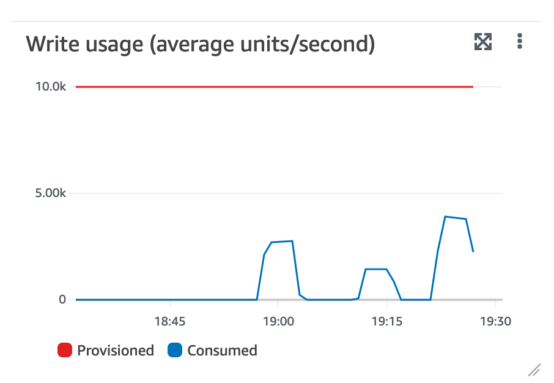
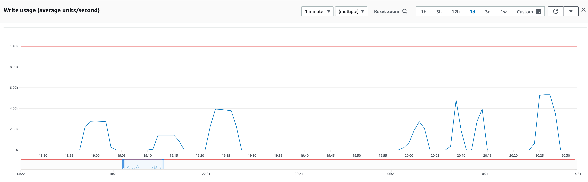

# Log

## ref.

https://e2eml.school/multiprocessing.html
python multi threading blog: https://towardsdatascience.com/multithreading-multiprocessing-python-180d0975ab29
batch update: https://stackoverflow.com/questions/44804994/dynamodb-batch-write-update
boto3: https://boto3.amazonaws.com/v1/documentation/api/latest/guide/dynamodb.html#batch-writing
python blocking queue: https://www.educative.io/courses/python-concurrency-for-senior-engineering-interviews/gkVzyO8V6Qj
click: pip install click
https://www.alexdebrie.com/posts/dynamodb-condition-expressions/

## Blog

TODO: note about costs.
TODO: generic solution for batch jobs

Executing large updates in DynamoDB may take a lot of time when using a straightforward solution (like 7 days in our case).
Batch operations speed things up considerably, as well as using different `WriteCapacityUnits` settings.
There's a limit, though and combining batch writer with subprocesses or threads and queues increases throughput even more.
Below I'll describe some experiments I've done with different approaches, and what their performance characteristics are.

We've been using DynamoDB for about a year now in production. In my opinion it works just fine most of the time. It's
flexible and resilient. Upgrades and the server processes itself are managed by AWS, so that's one less thing to worry about. Also, our
workload tends to be spiky.
Most of the time, we store or retrieve data for a specific customer. DynamoDB handles that kind of loads really well: get
record from storage and send it as JSON to a browser. As long as queries are about personal data
we have yet to run into performance problems.

Batch jobs require some extra design, though. One of our batch jobs produces a largish XML file that is stored on
S3. This job is implemented in Typescript and basically scans a table with about 25M records, selecting some
100K fraction. As long as the total export process finishes within 15 minutes, this will work fine as a lambda.

A bigger problem is massive updates that are caused by schema changes. Even though there is very little in the form of
an explicit schema (apart from partition keys and secondary indexes), the structure of data does change over time.
Two options present themselves to upgrade existing
data, like adding a new field. We could use a default in our code, which would solve
the problem of handling missing data. I'm not convinced this is a viable long term strategy. We may end up querying
data and manipulating it in code just to make sure data that was stored years ago can still be retrieved. What's more,
we're using appsync and graphql, so we might end up implementing more and more resolvers to transform data. Instead of
just relying on appsync.

In our case we also need to support a business intelligence system, used to generate management reports.
This system offers a SQL dialect to query DynamoDB data, allowing people outside our team to generate reports. If we changed
the schema but not the data, we would need to update the queries used by the BI tool. The introduction of new required field
was, in fact, the reason we started thinking about massive update scripts in the first place.

For the reasons above, we decided to update data when necessary. So now we had a new problem: how to update each record in our largish 25M record table?

I've tested the code described below using a local DynamoDB instance. You can find my experiments [here on GitHub](https://github.com/jvermeir/dynamodb).
To set up a local DynamoDB instance, see [this](https://hub.docker.com/r/amazon/dynamodb-local), or use the script in (TODO run-dynamo-local.sh).
Then we need a table for testing. This table is re-created using the script in (TODO: update-performance/setup/create-table.py).
Finally we need some data. I think 50_000 records is enough to test with. The script in (TODO: update-performance/setup/insert-test-data.py) inserts test data.
Note: I've tested using a Docker version of DynamoDB. This is not the real thing, of course.
But because costs are calculated per operation, it's way cheaper.

Our first naive attempt was to just read each record, add the new property and write it back. While this works, it takes
about 7 days. You can find the code in (TODO: update-performance/basic-solution/update-test-data.py).

This isn't going to work, obviously. The next attempt adds a batch writer. A set of records is updated in a single batch, reducing
network traffic and improving throughput. Nothing new here, of course, but it's nice to see that ancient wisdom still applies. The code is
in (TODO: update-performance/batch-solution/update-test-data.py). The only difference between the two versions of my
code is that

```
    [update(record) for record in data]
```

is replaced with

```
    with table.batch_writer() as batch:
        [update(record, batch) for record in data]
```

This version takes about a fifth of the time of the first solution. This may be caused by the Docker version of DynamoDB. In our
production system the script would have taken less than a day to complete.

But we can do better by using parallel processing.

Scanning can be done in parallel using segments:

```
    batch = table.scan(
        Segment=segment,
        TotalSegments=2,
    )
```

The Segment option divides the table in chunks that are processed in parallel. Parallel scanning is described in
[ParallelScan](https://docs.aws.amazon.com/amazondynamodb/latest/developerguide/Scan.html#Scan.ParallelScan)
and [bp-query-scan](https://docs.aws.amazon.com/amazondynamodb/latest/developerguide/bp-query-scan.html).

Combining this with threads allows parallel reading and writing of data. The code in ./queue-solution/update-test-data-queues.py introduces
a producer and consumer function. Producer reads a batch of data from the table. Each record is placed in a queue to be
processed by a consumer. The consumer updates the record and writes it back to the table.
Producer relies on batch reads for efficient reading.
Consumer uses a batch writer, comparable to the solution described in ./basic-solution/update-test-data-batch.py.
The sample code shows how to start a number of producers and consumers.

Using producers and consumers does increase code complexity. A list of threads is required, and we need a
way to terminate the program when all threads are done. In the example code, this is achieved with a waiter
that monitors the queue and exits the program once the queue becomes empty. The waiter is started after
the last producer is finished.

In pseudocode, this is what happens:

```
    start a bunch of producers
    start a bunch of consumers
    wait for producers to finish using the join option on thread
    start a waiter
    wait for the queue to become empty
    exit
```

In my simplified test setup, this solution is 50% faster than the batch solution. One thread would use the
idle time of another and thereby using resources more efficiently.

The question is how my Docker setup compares to the real thing. In the cloud we could use more resources, e.g.
* run the producers in a separate process
* but batches of records in SQS
* trigger a lambda for each batch

I expect this to be faster for larger tables. A local version of DynamoDB will probably have different performance characteristics from the cloud version.
Setting up lambda's and SQS is more complex however, maybe later...


## Insert records

### Read/Write = 100

```
    'ProvisionedThroughput': {
        'ReadCapacityUnits': 100,
        'WriteCapacityUnits': 100
    }
```
    
    2022-09-06T14:55:47.461Z: Deleting test_table
    2022-09-06T14:56:07.758Z: Creating test_table
    2022-09-06T15:24:46.812Z: Created test_table

28 minutes

count records in table

```
    aws dynamodb scan \
    --table-name test_table \
    --select COUNT
```


```
    'ProvisionedThroughput': {
        'ReadCapacityUnits': 200,
        'WriteCapacityUnits': 200
    }
```

12 minutes
    
    2022-09-08T17:46:17.446Z: Deleting test_table
    2022-09-08T17:46:37.731Z: Creating test_table
    2022-09-08T17:58:38.376Z: Created test_table

```
    'ProvisionedThroughput': {
        'ReadCapacityUnits': 500,
        'WriteCapacityUnits': 500
    }
```

3:40 minutes

    2022-09-08T18:52:20.484Z: Deleting test_table
    2022-09-08T18:52:40.758Z: Creating test_table
    2022-09-08T18:56:19.856Z: Created test_table


```
    'ProvisionedThroughput': {
        'ReadCapacityUnits': 1000,
        'WriteCapacityUnits': 1000
    }
```

2:46 minutes
800-900 kB/s

    2022-09-08T19:01:52.862Z: Deleting test_table
    2022-09-08T19:02:13.132Z: Creating test_table
    2022-09-08T19:04:59.333Z: Created test_table

    using 10_000 for capacity doesn't improve throughput


2 processes, 200k records, 1.7MB/s
5 minutes

2022-09-09T18:58:12.322Z: record: 0
2022-09-09T19:03:03.478Z: Created test_table
2022-09-09T18:58:14.490Z: record: 0
2022-09-09T19:03:08.005Z: Created test_table

3 processes, 200k records, 2.4MB/s
5 minutes

see 


## Use threads and queues 

1 producer, 2 consumers
200k records, 1.5MB/s
2.30 minutes

    2022-09-09T20:01:17.656Z: record: 0
    2022-09-09T20:03:45.467Z: record: 199000

1 producer, 4 consumers
200k records, 3.2MB/s
1.17 minutes

1 producer, 4 consumers
600k records, 3.2MB/s
3.44 minutes



note: upload speed is +/- 29Mbit/s so speed is limited by network capacity 


## Next steps

* benchmark with real DynamoDB
* translate to Kotlin and check (in theory this should be faster because of multi threading support)
* update multiprocess version to use queues (producer should block, multiple producers)

## TODO: test

batch and non batch
batch and threads
update in batch? 

local batch insert

    python ./insert-test-data.py

    2022-12-10T19:22:23.929Z: record: 0
    2022-12-10T19:22:24.518Z: record: 1000
    ....
    2022-12-10T19:24:04.470Z: record: 198000
    2022-12-10T19:24:04.979Z: record: 199000
    2022-12-10T19:24:05.477Z: Created test_table

80 sec. 

batch and threads

    python ./insert-test-data-queues.py

    2022-12-10T19:26:40.470Z: record: 0
    2022-12-10T19:26:40.708Z: record: 1000
    ...
    2022-12-10T19:27:19.363Z: record: 199000
    2022-12-10T19:27:19.559Z: record: 200000

39 sec.

## parallel update using update-test-data-queues.py

90_000 records

    blocking_q = BlockingQueue(15000) 
    number_of_producers = 1
    number_of_consumers = 1

    2022-12-19T12:41:45.787Z: producer: producer-0 count: 10281
    2022-12-19T12:42:33.369Z: thread_name: consumer-0, count: 90000

48 sec

    blocking_q = BlockingQueue(15000)
    number_of_producers = 1
    number_of_consumers = 5
    
    2022-12-19T12:40:17.120Z: producer: producer-0 count: 11315
    2022-12-19T12:40:47.618Z: thread_name: consumer-1, count: 18000

30 sec

    blocking_q = BlockingQueue(15000) 
    number_of_producers = 1
    number_of_consumers = 10

    2022-12-19T12:43:39.095Z: producer: producer-0 count: 10281
    2022-12-19T12:44:04.113Z: thread_name: consumer-5, count: 9000

25 sec

the Python client code takes up about 1 cpu
Dynamo running in Docker uses almost 2 cpu's
 
single threaded read/update loop

    2022-12-18T20:14:59.635Z: start
    2022-12-18T20:17:57.734Z: end

178 sec

## Overview

time to update 50_000 records in sec.

2023-02-25T21:06:41.181Z: end - basic solution, elapsed time: 0:02:21.911729 = 50_000/141 = 354 records/sec
2023-02-25T20:32:00.966Z: end - basic solution, batch write, elapsed time: 0:00:30.305891 = 50_000/30 = 1666 records/sec
2023-02-25T21:02:19.438Z: end - threads and queues, elapsed time: 0:00:20.164888 = 50_000/20 = 2500 records/sec
2023-02-25T20:57:47.109Z: end - multiprocessing, elapsed time: 0:00:15.147452 = 50_000/15 = 3333 records/sec

50_000 / 20 = 2500 records/sec

time to update 500_000 records:

2023-03-04T20:47:16.908Z: end - threads and queues, elapsed time: 0:03:35.125882
2023-03-04T21:13:36.575Z: end - multiprocessing, elapsed time: 0:03:55.154383

180+35 = 215 sec === 500_000 / 215 = 2333 records/sec

22M/2333 = 9400 sec = 2.5 hours

TODO 

| read/update | proc/1 cons | proc/5 cons |proc/10 cons |
|-------------|-------------|------------|------------|
|  178        |  48         |30 |25 |


65_000 records, 40 sec 

### TODO

use parallel scan:
see page 267 of The DynamoDB Book
see page 346 'Fetch all Brands' pattern for categories and ingredients (maybe? we store all ingredients in a singleton.
this may be too much for a single record? categories should be ok).

```
scan(
...
        Segment=segment,
        TotalSegments=total_segments,
...        
)
```

blocking queues from Python standard lib?

## Dynamo queries and stuff

```
aws dynamodb create-table --table-name test_table \
--attribute-definitions AttributeName=orderId,AttributeType=S \
--key-schema AttributeName=orderId,KeyType=HASH \
--billing-mode PAY_PER_REQUEST \
--endpoint-url http://localhost:8000
```

```
aws dynamodb scan \
--table-name test_table \
--select COUNT \
--endpoint-url http://localhost:8000
```

